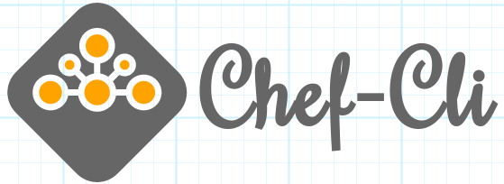
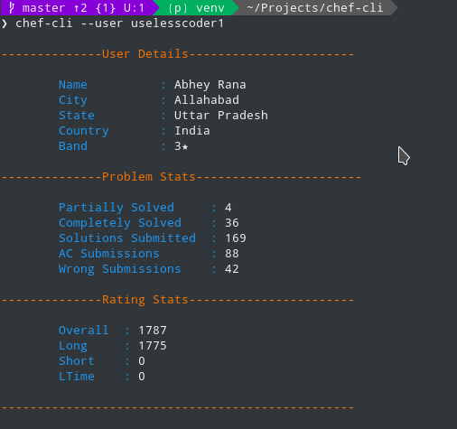

#Chef-Cli



CodeChef command line interface. ChefCLI helps competitive coders to search, view, and submit problems in CodeChef.

##Table of Contents

- [Introduction](#introduction)
- [Features](#features)
- [Installation Instruction](##installation)
- [Screenshots](#screenshots)
- [Feedback](#feedback)
- [Contributors](#contributors)
- [Contribute](#contribute)
- [Acknowledgement](#acknowledgment)

##Introduction

Chef-Cli is a command line interface which uses CodeChef’s official API. This application is for those who hate graphical application and love to do everything from terminal.  With features like sample submit and problem recommendation, It is designed to improve the overall productivity of the user.

##Features

- View Problem Statement In Terminal
- Get complete profile information about a particluar user.
- Get a graph of submissions made by the user in past one year. (Similar to submission graph of SPOJ)
- Compare profiles of two users based on the ranking in various formats. Alos get a comparison graph right on the terminal for better visualization
- Submit a problem for evaluation against sample test cases and see if it passes or not.
- Problem Recommendation
 - Recommends problem based on past solved problems by a user.
 - Uses content based recommendation system for problem recommendation.
 - Parameters - Difficulty , tags , No. of users who solved , Rating of user who solved
- Submit problems to CodeChef IDE directly from the terminal and get the final result right on the terminal.
- Get list of both upcoming and currently running contests.
- Get all details about a contest.
- Get list of all the languages on codechef.
- Get list of problems with a particular tag.
- Search an institution from registered institution on Codechef.

##Installation Instruction

- Chef-CLI is available as a python package.

- Open terminal and run ```pip install chef-cli```

- This installs the CLI app.

- Now run chef-cli --help to know the available commands

- Enjoy !!

##Screenshots

**View Problem Statements In Terminal**


**User's Profile Information**



**User's Submission Graph**


**Profile Comparison**


**Sample Submit**


**Recommend Problem**


##Feedback

Feel free to send us feedback on [Email](mailto:mohitfeuhrer@gmail.com) or [file an issue](https://github.com/mkfeuhrer/chef-cli/issues).

##Contributors

- [Abhey Rana](https://github.com/Abhey)
- [Mohit Khare](https://github.com/mkfeuhrer)

##Contribute

- Feel free to report issues and bugs.It will be helpful for future launches of application.
- All Suggestions are welcome.
- Fork repository and Contribute.

##Acknowledgment

Thanks to [CodeChef](https://codechef.com/) for providing CodeChef Api and [Alibaba Cloud](https://www.alibabacloud.com) for providing platform.
